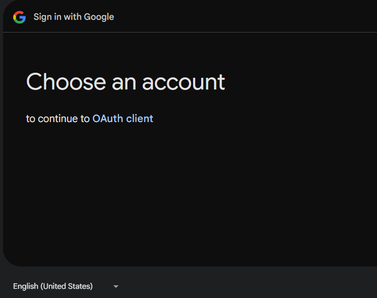
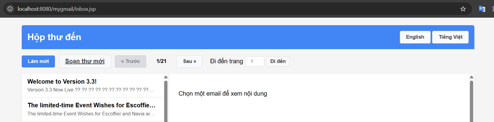
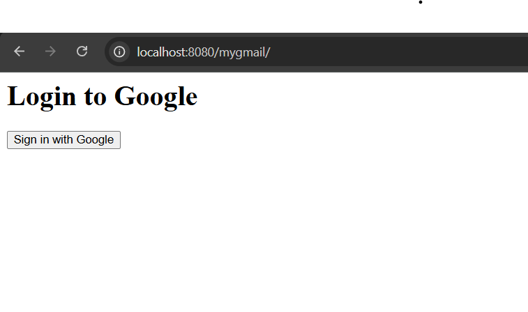
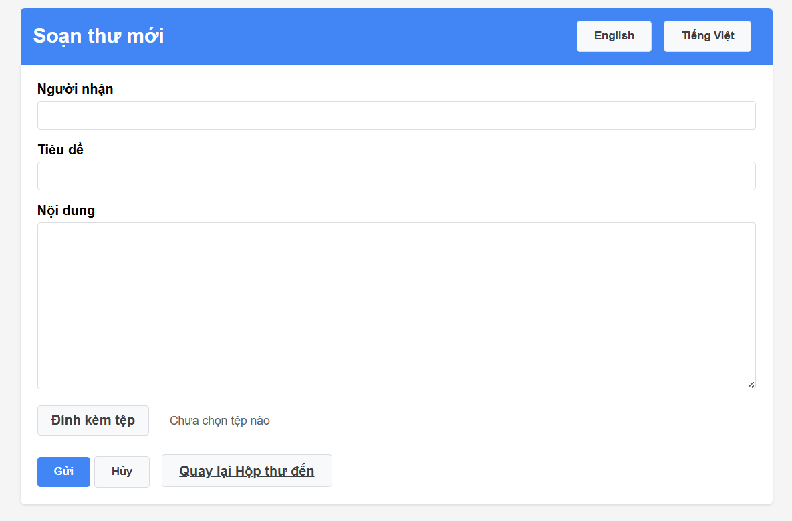

# webTech_and_eService
# Overview
This project encompasses multiple web technologies and services, including:
Google OAuth Integration: Implemented in the GoogleOAuth directory.

# 📸 Demo Images

- 1. Google OAuth API Integration

- 2. Inbox Interface

- 3. Login Page

- 4. Sending Email View

# Google OAuth Integration
The GoogleOAuth directory contains code for integrating Google OAuth authentication into the application. This allows users to log in using their Google accounts, enhancing security and user experience.

# Setup Instructions
git clone https://github.com/lehau007/webTech_and_eService.git
cd webTech_and_eService

read readToRun to run
